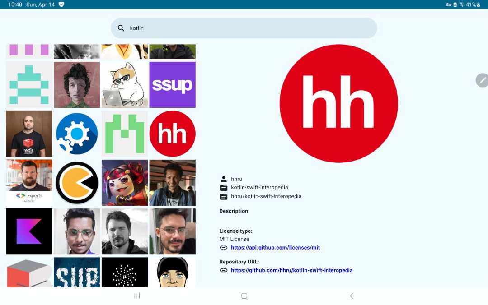

# GithubRepositories
Android native app to search GitHub repositories

# Description
Application contains one screen with a search field and a list of repositories. The list is populated after the user enters a search query.

The search query is saved in a history list that can be accessed later.

Tablet and phone UI for both portrait and landscape modes.

# Technologies
Kotlin, Compose, MVVM architecture, ViewModel

Coroutine, Flow, Paging 3 (pagination/endless scroll), Coil (image load), Timber (logging), Gson (JSON serialize/deserialize)

**Dependency injection**: Hilt

**Networking**: Retrofit (support for empty body response, custom error body response, automatically retry the call for 3 times if you receive a server error (5xx))

**Testing**: unit tests, fakes, JUnit4, Mockk

**Warning**: *Before running the app, replace the <github_api_key> string inside build.gradle.kts, with a real access token generated from your GitHub account, otherwise you'll receive a '**Bad credentials**' error.*

# Pixel 7 pro screenshots
 

# Samsung Tab S7+ screenshots
 
